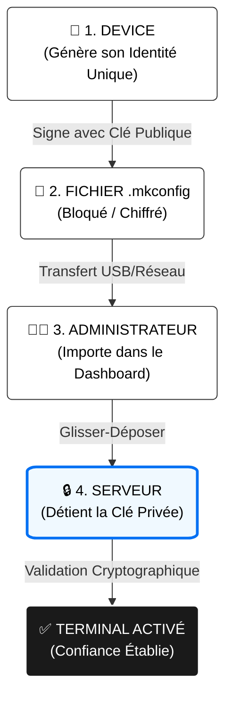

<div align="center">

# 📱 MOBI-KIOSK
### La Révolution EMM/MDM/UEM à l'ère du Web 3 - Édition 2025

[](https://github.com/NBILITY-HOME/MOBI-KIOSK)
[](https://github.com/NBILITY-HOME/MOBI-KIOSK)
[](https://github.com/NBILITY-HOME/MOBI-KIOSK)

<br />

> **"Ne me donnez pas vos identifiants. Prouvez-moi qui vous êtes."**
>
> *Une approche radicalement nouvelle de la sécurité des terminaux mobiles.*

<br />

</div>

---

## 🚀 Vision & Révolution
Alors que le marché sature de solutions EMM/MDM/UEM (Mobile Device Management) basées sur des modèles archaïques "Login + Mot de passe", **Mobi-Kiosk** brise les codes. Nous ne gérons pas des *comptes*, nous certifions des *identités*.

L'ère de la simple authentification est révolue. Bienvenue dans l'ère de la **Preuve Cryptographique**.

## ⚙️ Mécanique de Confiance : Technical Deep Dive

Mobi-Kiosk redéfinit l'enrôlement des terminaux via un protocole asymétrique strict. Voici comment le chaînon de confiance est établi.

### Le Cycle de Vie du Fichier `.mkconfig`



### 1. Genèse sur le Device (The Proof)
Contrairement aux MDM ou EMM classiques où le serveur "pousse" une config, ici c'est le terminal qui **initie** sa propre demande d'existence.
- L'application Mobi-Kiosk génère une empreinte unique (Hardware ID + Timestamp + Challenge).
- Cette empreinte est **chiffrée** immédiatement avec la Clé Publique du Serveur (embarquée dans l'APK).
- **Résultat** : Un fichier binaire `.mkconfig` totalement illisible pour quiconque sauf le serveur.

### 2. Import Contextuel ( The Context)
L'administrateur récupère ce fichier (inutile pour un attaquant).
- Dans le Dashboard Admin, il navigue vers la cible exacte : *Pays > "France" > Organisation > "Paris Store"*.
- Il glisse le fichier `.mkconfig` dans cette zone.

### 3. Révélation (The Activation)
Le serveur reçoit le fichier .mkconfig chiffré.
- Il utilise sa **Clé Privée** (stockée en Hardware Security Module ou Vault sécurisé) pour déchiffrer le contenu.
- Il vérifie la signature interne.
- Si valide : Le device est reconnu, associé à l'organisation "Paris Store", et reçoit son token de session final.

> **Pourquoi est-ce révolutionnaire ?**
> "C'est l'équivalent d'un **Wallet Crypto** pour vos appareils. Pas de mot de passe à phisher, juste une preuve cryptographique infalsifiable."

<br />


## 🔮 L'Expérience Mobi-Kiosk : Au delà du EMM

Brisez les chaînes des déploiements lourds et coûteux ou les standards du marché vous vendent des mois d'intégration et de formation. Mobi-Kiosk offre une maîtrise immédiate et une expérience de pilotage **immersive**.
 
### 1. La Tour de Contrôle (Dashboard 2025)
Votre flotte n'est pas une liste, c'est un organisme vivant.
*   **Mobi-Globe 3D** : Visualisez l'état de santé de vos terminaux sur une carte interactive en temps réel. Un terminal passe hors ligne à Tokyo ? Vous le voyez à la seconde près.
*   **Design "Glassmorphism"** : Une interface épurée, fluide (60 FPS), conçue pour réduire la charge mentale des administrateurs.
*   **Métriques Instantanées** : Batterie, Stockage, Signal... Anticipez les pannes avant qu'elles n'arrivent.

### 2. "Organization" : Notre Arme Secrète 🚀
C'est ici que nous laissons la concurrence loin derrière. La plupart des solutions EMM/MDM/UEM vous offrent des "Groupes" à plat. **Mobi-Kiosk réinvente la structure fractale.**

*   **Structure Infinie** : Créez une hiérarchie qui matche *réellement* votre entreprise.
    *   *Monde > France > Paris > Boutique Champs-Élysées > Rayon Homme.*
*   **Héritage Intelligent** : Appliquez une politique de sécurité au niveau "France", elle redescend automatiquement sur toutes les sous-organisations.
*   **Segmentation Chirurgicale** : Besoin de mettre à jour uniquement les tablettes du "Rayon Homme" ? C'est fait en 2 clics.
*   **Drag & Drop** : Réorganisez votre entreprise comme vous déplacez des fichiers. Une filiale déménage ? Glissez-la simplement vers sa nouvelle région.

### 3. Gestion de Flotte "Zéro-Friction"
Gérer 10 000 terminaux devient aussi simple que d'en gérer 10.
*   **Enrôlement Éclair** : Importez, Validez, c'est prêt.
*   **Commandes de Masse** : Redémarrez, verrouillez ou mettez à jour un parc entier en une commande signée.

> **Le Verdict** : Là où les autres vous vendent de la *maintenance*, Mobi-Kiosk vous offre de la **maîtrise**.

## 🛠️ Installation Rapide
Mobi-Kiosk est conteneurisé pour un déploiement instantané.

```bash
# Cloner le repository
git clone https://github.com/NBILITY-HOME/MOBI-KIOSK.git

# Lancer la stack complète (Frontend + Backend + Redis + Postgres)
./start_services.sh

# Accéder au Dashboard
# http://localhost:3001
```

---
<div align="center">
<p>Développé avec passion pour le futur de la sécurité mobile.</p>
<p>© 2025 Mobi-Kiosk Solutions</p>
</div>
